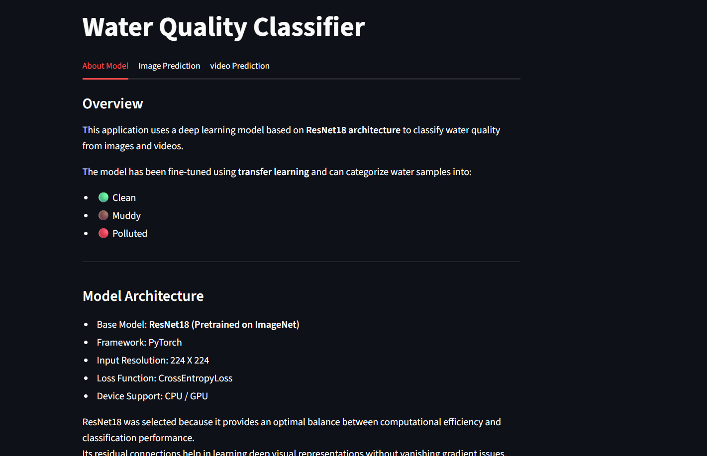
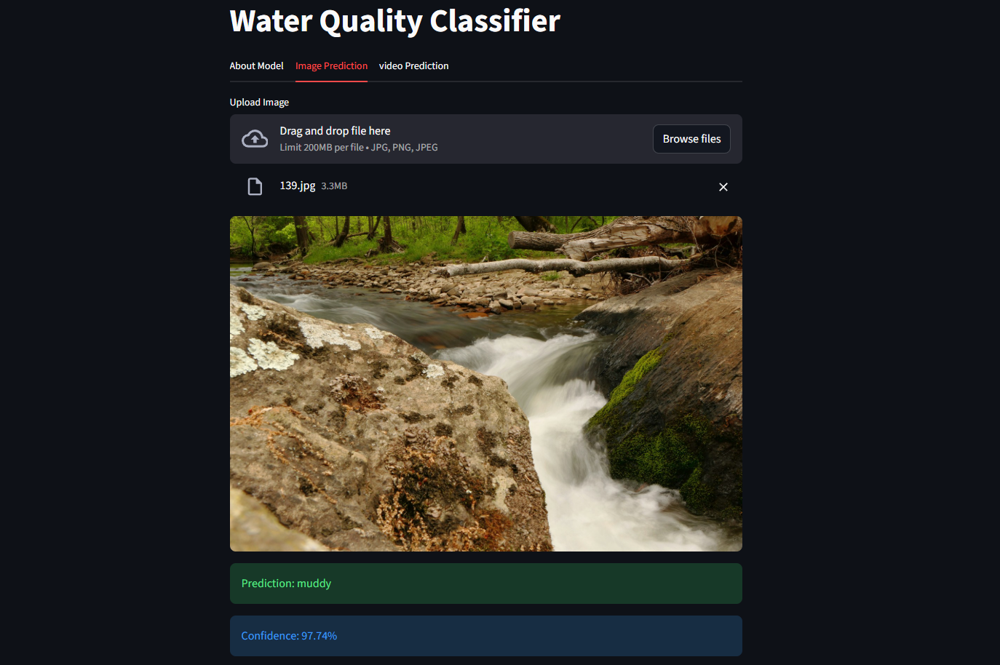
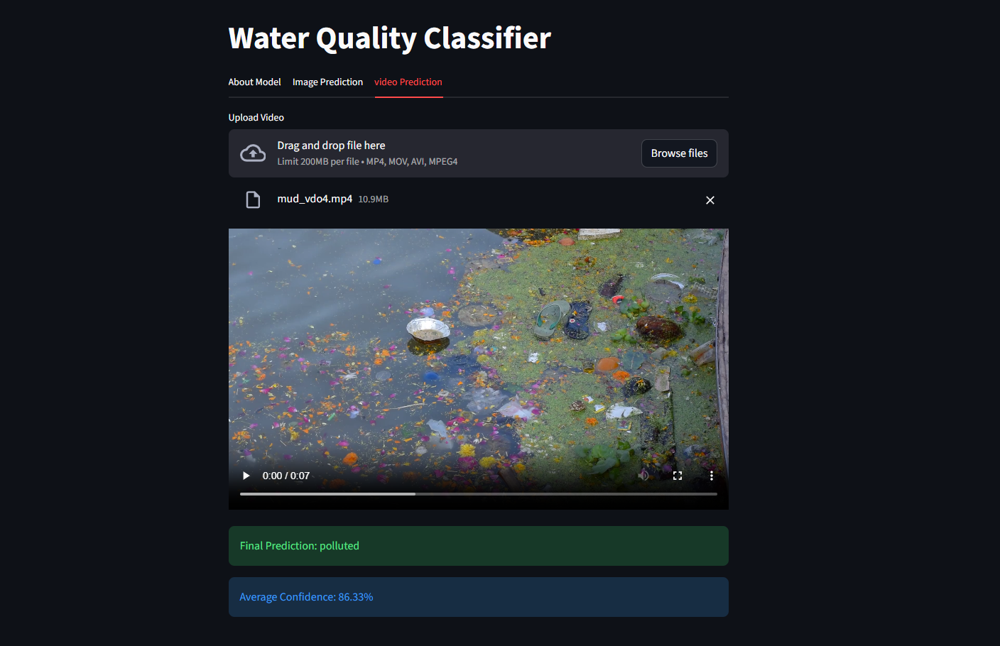

# Water Quality Classification using Deep Learning

An end-to-end deep learning system for classifying water quality from images and videos into:

- Clean
- Muddy
- Polluted

The project uses transfer learning with ResNet18, along with optimization techniques to improve generalization and reduce overfitting.

---

## 🚀 Key Features

- Image and video-based prediction

- Transfer learning using pretrained ResNet18

- Fine-tuning with selective layer unfreezing

- Learning rate scheduling + early stopping

- Data augmentation for better generalization

- Modular pipeline (data → training → inference)

- Streamlit-based UI for real-time predictions

---

## Working Demo

[Watch Demo Video](https://drive.google.com/file/d/1QncrbrDoZ6AXWrFxbgrqDrbpdOtj9Mt6/view?usp=sharing)

## Screenshots

### About Model



### Image Prediction



### Video Prediction



---

## Project Structure

```
src/        → core logic (model, training, prediction)
scripts/    → execution scripts
data/       → dataset (raw + split)
artifacts/  → trained model weights
app.py      → Streamlit UI
```

## Dataset Preparation

```bash
python -m Scripts.data_preparation
```

- Splits dataset into train/test (80/20)
- Ensures reproducibility using fixed random seed

## Model Training

To Train the model:

```bash
python -m Scripts.train_model
```

#### Training Highlights:

- Transfer learning (ImageNet pretrained ResNet18)
- Fine-tuning (last layer + layer4)
- Optimizer: Adam + Weight Decay
- Scheduler: StepLR
- Early stopping based on validation accuracy

## Model Performance

- Best Validation Accuracy: ~85%
- Controlled overfitting (train-val gap ~8%)
- Evaluated using: Accuracy, Classification Report, Confusion Matrix
- **Result**: Improved validation accuracy from **~76% to ~85%**

---

## Inference

#### Image Prediction

```
python -m scripts.prediction
```

#### Video Prediction

- Extracts frames
- Predicts each frame
- Uses majority voting for final result

---

## Streamlit App

```bash
streamlit run app.py
```

#### Features:

- Upload image/video
- Real-time prediction

---

## Installation

```
python -m venv .venv
.venv/Scripts/activate
pip install -r requirements.txt
```

---

## 📌 Key Learnings

- Handling overfitting using augmentation and regularization
- Trade-off between model accuracy and generalization
- Fine-tuning pretrained models effectively
- Importance of validation-based model selection

---

## Limitation

- Dataset is relatively small (~600 images)
- Limited real-world variability (lighting, camera noise)
- Performance may drop on unseen real-world conditions

## Author

Final Year B.Tech Project

Water Quality Classification System
